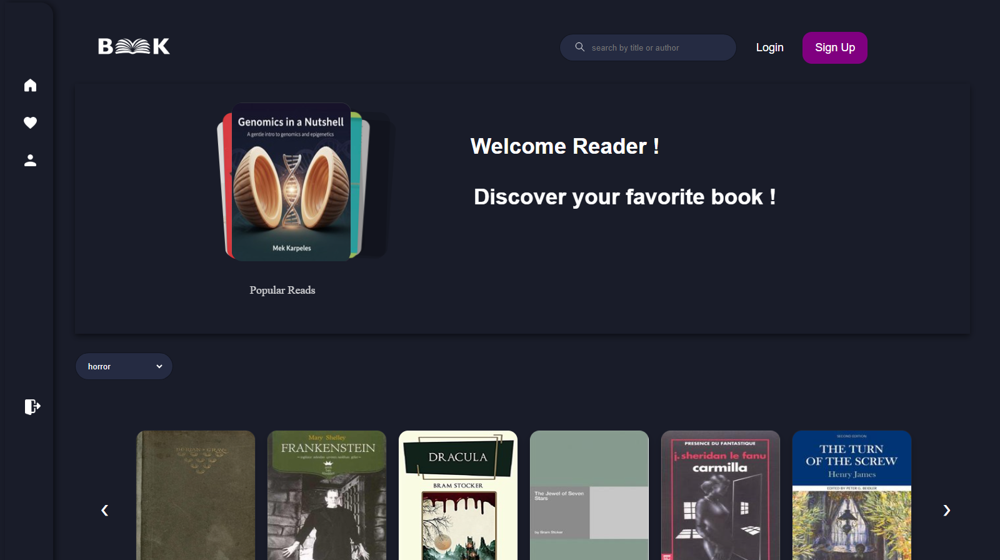

# E-Library 



A modern digital library application that allows users to discover, search, and manage their book collection with advanced features and user authentication.

##  Description

E-Library is a full-featured digital library platform that leverages the OpenLibrary API to provide access to millions of books. Users can search, discover, download and organize their reading materials.

##  Tech Stack

| Technology | Purpose |
|------------|---------|
| **React.js** | Frontend framework and component-based architecture |
| **Redux Toolkit** | State management for global application state |
| **Axios** | HTTP client for API requests to OpenLibrary |
| **Swiper JS** | Interactive book carousels and sliders |
| **CSS3** | Custom styling and responsive design |
| **OpenLibrary API** | Comprehensive book data and metadata |

##  Key Features

- Advanced Search - Search books by title, author
- Book Discovery - Browse books by categories and genres
- Favorites System - Add/remove books to personal favorites
- Download Options - Access book download links
- User Authentication - Create account, login, and logout functionality
- Fast Performance - Efficient state management with Redux Toolkit


##  Setup Instructions

### Prerequisites
- Node.js 
- npm or yarn package manager

### Installation & Local Development

```bash
# Clone the repository
git clone https://github.com/ikramelfrnani/e_library.git

# Navigate to project directory
cd e_library

# Install dependencies
npm install

# Start the development server
npm start

# The application will open in your browser at http://localhost:3000
```
##  Author

**Ikram El Frnani**
- **GitHub**: [@ikramelfrnani](https://github.com/ikramelfrnani)
- **LinkedIn**: [Ikram El Frnani](https://linkedin.com/in/ikram-el-frnani-9314a2201)  
- **Portfolio**: [ikramelfrnani.vercel.app](https://ikramelfrnani.vercel.app/)
